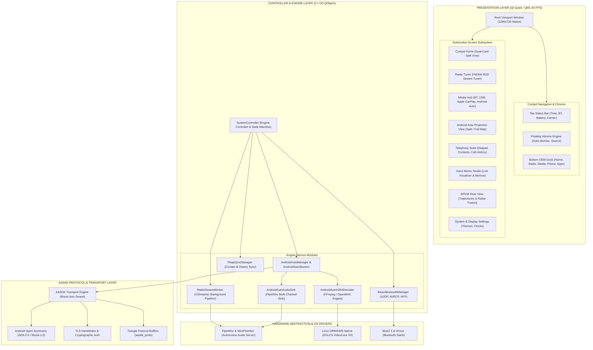

# Apex HORIZON IVI - Automotive In-Vehicle Infotainment System

<div align="center">


### Production-Grade Automotive Human-Machine Interface (HMI) and Digital Head Unit

[](https://www.qt.io/)
[](https://isocpp.org/)
[](CMakeLists.txt)
[](.github/workflows/build-macos.yml)
[](.github/workflows/build.yml)
[](.github/workflows/build-windows.yml)
[](https://github.com/skrehanahamed/Apex_MidEnd_IVI/releases)
[](https://github.com/skrehanahamed)
[](LICENSE)

<br/>

<sub>Made by <b>Sk Rehan Ahamed</b> with the help of <b>Antigravity</b> and <b>ChatGPT</b></sub>

</div>

---

## Executive Overview

Apex IVI is a production-grade automotive In-Vehicle Infotainment (IVI) system and digital head unit designed with Qt 6 (QML / Qt Quick) and modern C++20. Modeled on 8-inch Display Audio (D-Audio) touchscreen architectures used in modern connected vehicles, the system features hardware-accelerated 60 FPS graphical rendering, native Android Auto projection via AASDK, low-latency multi-channel audio via PipeWire, live internet radio streaming, Bluetooth hands-free telephony with PBAP contact synchronization, and dynamic parking telemetry.

The architecture decouples the QML presentation layer from deterministic C++ backend controllers, establishing an automotive-compliant state machine that manages live media playback, audio arbitration, sensor fusion, and accessory communication.

---

## Release Notes: September 14, 2026 (v1.2.0)

Date of Update: September 14, 2026  
Release Version: v1.2.0

### Key Deliverables and Enhancements Added Today:

1. Native Android Auto Integration (AASDK Protocol Engine)
   - Integrated full Android Open Accessory (AOA) 2.0 protocol directly into Apex IVI without external emulator dependencies.
   - Built an embedded SSL/TLS cryptographic handshake engine running on a dedicated Boost.Asio I/O strand for phone authentication.
   - Implemented multi-channel AASDK protocol dispatch:
     - Channel 1 (Control): Service discovery, authentication, ping keepalive, and graceful session teardown.
     - Channel 2 (Sensor): Driving status, night mode, and vehicle telemetry dispatch.
     - Channel 3 (Video): H.264 video decoding pipeline streaming 1280x720 60 FPS to a custom QQuickItem (`AndroidAutoVideoItem`).
     - Channels 4, 5, 6 (Audio): Media audio, speech/voice guidance, and system alert routing to PipeWire PCM sinks.
     - Channel 7 (Input): Absolute multi-touch coordinate mapping and hardware media button handling.

2. Dual Projection UX Modes (Android Auto and Full Map View)
   - Android Auto Split-Screen: Default multi-view dashboard displaying simultaneous navigation map, active media widget, and status rail.
   - Full Map View: Dedicated one-tap projection mode from the main IVI screen that automatically expands Google Maps to full-screen navigation.
   - Drawer Return Integration: Intercepted Android Auto drawer home taps (`onShutdownRequest`) to seamlessly return to the native OEM IVI home screen.
   - Removed splash screen loading delays for an instantaneous dark transition.

3. Audio Priority Arbitration and Zero-Latency Cutoff
   - Mutual Audio Exclusion: Real-time coordination between native FM/AM radio, Bluetooth media, and Android Auto music playback.
   - Instant Channel 4 Detection: Configured AASDK `AudioEventHandler` to monitor incoming media packets on Channel 4, immediately claiming audio focus and pausing native radio when phone media starts playing.
   - Sub-Millisecond Radio Pause: Replaced GStreamer SIGTERM buffer draining with direct `SIGKILL` termination and process sweep (`killall -9 gst-play-1.0`), achieving immediate audio cutoff (<1 ms) without lingering sound.
   - Reverse Arbitration: Tapping native FM/AM radio or USB media immediately dispatches `KEYCODE_MEDIA_PAUSE (127)` over Android Auto Input Channel 7.

4. Seamless USB Hotplug and Reconnect Engine
   - Added `apex-usb-reset.py` using Linux `USBDEVFS_RESET` ioctl calls to reset AOA accessory endpoints on deploy or reconnection without physical USB unplugging.
   - Fixed systemd unit service dependencies to eliminate device reconnect cycles.

---

## System Architecture



---

## Subsystem Specifications

### 1. Android Auto Projection Engine (AASDK)
- Protocol: Google Android Auto protocol version 1.6 / 1.7 over Android Open Accessory (AOA) 2.0.
- USB Communication: Asynchronous transfer handling via `libusb-1.0` polling on dedicated thread.
- Cryptography: OpenSSL TLS 1.2 / 1.3 socket wrapper performing handshake verification.
- Channel Map:
  - Channel 1 (Control): Control service channel managing authentication and ping tokens.
  - Channel 2 (Sensor): Driving status (`DRIVING_STATUS_UNRESTRICTED`) and night mode telemetry.
  - Channel 3 (Video): H.264 video pipeline decoding 1280x720 video frames at 60 FPS.
  - Channel 4 (Media Audio): 48 kHz 16-bit stereo PCM streaming to PipeWire `media` audio sink.
  - Channel 5 (Speech Audio): 16 kHz 16-bit mono PCM streaming to PipeWire `speech` audio sink.
  - Channel 6 (System Audio): 16 kHz 16-bit mono PCM streaming to PipeWire `system` alert sink.
  - Channel 7 (Touch & Input): Absolute touchscreen events with coordinate scaling and hardware keycodes.

### 2. Dual-Projection Navigation
- Split-Screen Mode: Standard Android Auto widescreen UI with navigation rail on the right (x=1238, y=271) and active content viewport on the left.
- Full Map Mode: Single-tap invocation from the main IVI home screen translates touch inputs to expand Google Maps into full-screen view.
- Return to OEM IVI: Tapping the vehicle home icon in the Android Auto app drawer dispatches `onShutdownRequest`, immediately restoring the native cockpit home screen.

### 3. Audio Architecture & Priority Arbitration
- Audio Server: PipeWire with WirePlumber session manager configured for pro-audio quantum size (1024) and stable HDMI audio clocking.
- Arbitration Rules:
  - Phone Calls (HFP / oFono): Highest priority. Halts all media playback and mutes background audio streams.
  - Android Auto Media (Channel 4): High priority. Automatically pauses native FM/AM radio and Bluetooth audio when incoming audio packets are detected.
  - Native Radio / USB / Bluetooth: User selection triggers an immediate `KEYCODE_MEDIA_PAUSE (127)` packet to Android Auto, stopping phone playback.
  - Radio Pipeline: Managed by `RadioStreamWorker` using `gst-play-1.0` outputting to PipeWire sink with instant `SIGKILL` termination (<1 ms).

### 4. Telephony & Bluetooth Suite
- Protocol: BlueZ 5 D-Bus API (`org.bluez.MediaPlayer1`, `org.bluez.MediaControl1`, `org.bluez.Device1`).
- Phonebook Access Profile (PBAP): Automated vCard 2.1/3.0 parsing for contacts and call history synchronization.
- Hands-Free Profile (HFP): Native oFono telephony modem driver integration with bidirectional call state management.

---

## Directory Structure

```
Apex_MidEnd_IVI/
├── CMakeLists.txt                # CMake build configuration for Qt 6 and AASDK
├── README.md                     # System documentation and architecture guide
├── THIRD_PARTY_LICENSES.md       # Open-source license attribution
├── resources.qrc                 # Qt resource bundle
├── assets/                       # UI iconography, fonts, and branding
│   ├── auto/                     # Android Auto icons and projection assets
│   ├── bluetooth/                # Bluetooth status and playback controls
│   ├── branding/                 # Apex logo and design marks
│   └── ui/                       # Cockpit controls and navigation icons
├── cert/                         # Local development certificate files
├── qml/                          # Qt Quick 6 presentation layer
│   ├── Main.qml                  # Root window and viewport coordinator
│   └── components/
│       ├── navigation/           # Top status bar, bottom dock, volume popup
│       └── screens/              # Cockpit application screens
│           ├── AndroidAutoScreen.qml
│           ├── HomeScreen.qml
│           ├── RadioScreen.qml
│           ├── MediaSelectScreen.qml
│           ├── BluetoothAudioScreen.qml
│           ├── PhoneScreen.qml
│           └── AllMenusScreen.qml
└── src/                          # C++20 backend engines
    ├── main.cpp                  # Application entry point and display config
    ├── SystemController.hpp/.cpp # Main IVI state machine and coordinator
    ├── AndroidAutoManager.hpp/.cpp # AASDK worker bridge and lifecycle
    ├── AndroidAutoSession.hpp/.cpp # AOA, TLS, protocol channels handler
    ├── AndroidAutoH264Decoder.hpp/.cpp # Video decoding engine
    ├── AndroidAutoAudioSink.hpp/.cpp   # PipeWire multi-channel audio sink
    ├── AndroidAutoVideoItem.hpp/.cpp   # Hardware texture rendering item
    ├── BluezBluetoothManager.hpp/.cpp  # BlueZ 5 D-Bus integration
    ├── PbapSyncManager.hpp/.cpp  # PBAP contact synchronization
    └── NativeAudioRecorder.h/.cpp/.mm # Platform audio recorder
```

---

## Build and Deployment

### Cross-Compilation for Raspberry Pi 5 (Yocto Scarthgap)

Cross-compilation is executed inside a containerized Yocto Scarthgap build environment:

```bash
# Build via CMake and Ninja cross-compiler
docker run --rm \
  -v /path/to/rpi5-yocto-qt-env:/workspace \
  -v yocto-tmp:/workspace/build/tmp \
  rpi5-yocto-scarthgap-builder bash -c "
    export PATH=/workspace/build/tmp/work/cortexa76-poky-linux/apex-ivi/1.0/recipe-sysroot-native/usr/bin:\$PATH && \
    ninja -C /workspace/build/tmp/work/cortexa76-poky-linux/apex-ivi/1.0/build && \
    aarch64-poky-linux-strip -s /workspace/build/tmp/work/cortexa76-poky-linux/apex-ivi/1.0/build/ApexIVI -o /workspace/deploy/ApexIVI
  "
```

### Direct Target Deployment

```bash
# Deploy binary and reset USB AOA state
scp deploy/ApexIVI root@192.168.1.217:/tmp/ApexIVI
ssh root@192.168.1.217 "
  systemctl stop apex-ivi && \
  mv /tmp/ApexIVI /usr/bin/ApexIVI && \
  chmod +x /usr/bin/ApexIVI && \
  /usr/bin/python3 /usr/bin/apex-usb-reset.py || true && \
  systemctl start apex-ivi
"
```

---

## GitHub Actions Continuous Integration

The repository includes continuous integration workflows in `.github/workflows/`:

- `build.yml`: Compiles and verifies the Linux Qt 6 application with CMake and Ninja on Ubuntu 22.04.
- `build-macos.yml`: Validates macOS build targets with Clang and AVFoundation native audio integration.
- `build-windows.yml`: Validates Windows build targets with MSVC 2022.
- `release.yml`: Automated multi-platform release packager producing versioned binaries and distribution archives.

---

## Third-Party Credits and Acknowledgments

We gratefully acknowledge the following open-source projects, tools, and research that made the development of Apex IVI possible:

- f1xpl / aasdk: Foundational open-source C++ implementation of the Android Auto protocol SDK, including message encapsulation, channel abstractions, and protocol buffer models.
- f1xpl / openauto and opencardev / crankshaft: Landmark open-source automotive head unit implementations for Raspberry Pi that pioneered community Android Auto integration.
- Steffen K. / aa-proxy-rs: High-performance Rust reverse-engineering reference for Android Auto accessory protocol handling and USB data framing.
- PipeWire and WirePlumber: Modern, low-latency automotive multimedia infrastructure providing flexible audio graph routing and synchronization.
- Qt Project: Cross-platform GUI and application framework (Qt Quick, QML, QtMultimedia).
- The Yocto Project and Raspberry Pi: Embedded Linux distribution architecture, Poky reference system, and Raspberry Pi 5 hardware support layers.

---

## License

This project is licensed under the MIT License - see the [LICENSE](LICENSE) file for details.
Third-party licenses and acknowledgments are documented in [THIRD_PARTY_LICENSES.md](THIRD_PARTY_LICENSES.md).
