# Apex IVI - Automotive In-Vehicle Infotainment System

<div align="center">


### Production-Grade Automotive Human-Machine Interface (HMI) & Digital Head Unit

[](https://www.qt.io/)
[](https://isocpp.org/)
[](CMakeLists.txt)
[](.github/workflows/build-macos.yml)
[](.github/workflows/build.yml)
[](.github/workflows/build-windows.yml)
[](https://github.com/skrehanahamed)
[](LICENSE)

</div>

---

## Executive Overview

**Apex IVI** is a production-grade, photorealistic automotive In-Vehicle Infotainment (IVI) and digital head unit simulation engineered using **Qt 6 (QML / Qt Quick)** and modern **C++20**. Modeled directly on authentic **8-inch Display Audio (D-Audio) touchscreen architectures** utilized in modern automotive cockpits, the system features deterministic hardware-accelerated 60 FPS graphical rendering, live broadcast audio streaming, native low-latency audio capture, and full parking telemetry integration.

The architecture strictly decouples the QML presentation layer from deterministic C++ backend controllers, establishing an automotive-compliant state machine that handles live internet radio streams, hands-free telephony, ultrasonic radar sensor fusion, dynamic steering parking trajectories, and system-wide audio equalization.

---

## System Architecture & Subsystems

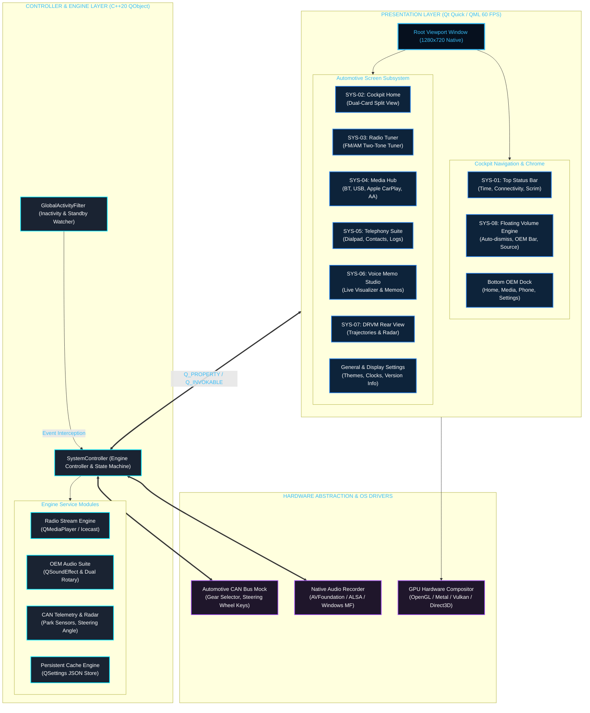

> 📄 *Source architecture specifications are also available in PlantUML format: [`docs/architecture/system_architecture.puml`](docs/architecture/system_architecture.puml)*

---

## Core Engineering Features

### `SYS-01` Core Head Unit Architecture & Specular Bootloader
- **Specular Sweep Startup**: Metallic laser-cut APEX emblem with dynamic diagonal light sweep, real-time CAN bus telemetry synchronization sequence, and cross-fade bootloader transition.
- **Persistent Global Chrome**: Top status bar displays real-time date/clock (`Sat, 10/02 | 11:34 AM`), connectivity indicators (Bluetooth, Cellular, Hands-Free), and the OEM pill navigation button.
- **Sliding Viewport Router**: Smooth 350ms easing transitions across nested sub-screens with automated page resets upon returning to Home.

### `SYS-02` Cockpit Dashboard & Dual-Card Split Layout
- **Left Radio Card**: Real-time broadcast playback card displaying active band (**`FM`** in blue, frequency in white), current station RDS data, and previous/next station preset steppers.
- **Right Phone Projection Card**: Vector car outline with smartphone connection badges for Apple CarPlay and Android Auto.
- **OEM Bottom Dock**: 4 factory navigation targets featuring custom vector icons:
  1. **All Menus** (3x3 grid with cyan accent square)
  2. **Phone** (Handset with radiated acoustic waves)
  3. **Media** (Musical eighth note with dynamic acoustic rings)
  4. **Settings** (Mechanical cogwheel with illuminated cyan hub)

### `SYS-03` AM / FM Broadcast Radio Engine & Live Audio Streaming
- **Two-Tone Frequency Display**: Genuine automotive styling where the band indicator (**`FM`** / **`AM`**) is illuminated in vivid cyan-blue (`#38B6FF`) while station frequency digits (`93.5`, `98.3`, `102.9`) remain crisp white (`#FFFFFF`).
- **Live Internet Stream Integration**: C++ `QMediaPlayer` backend natively streams live audio broadcasts (e.g. Radio Mirchi 98.3, AIR National AM 657, Suryan FM 93.5) with automatic fallback buffering.
- **Automotive Tuning Controls**:
  - `Seek Down (◀)` & `Seek Up (▶)` with tap-to-step and press-and-hold frequency rolling sweep.
  - One-touch favorite star (`★`) button with persistent memory saving.
  - Dedicated Station List drawer and multi-select Delete Favorites modal.

### `SYS-04` Digital Rear View Monitor (DRVM) & Parking Guidance
- **16:9 High-Definition Camera Feed**: Integrated photorealistic wide-angle rear camera view (`1280x720`).
- **Dynamic Parking Guidance Trajectories**: Multi-tiered colored parking distance guidelines:
  - **Red Zone (0.5m)**: Critical stopping barrier
  - **Yellow Zone (1.0m - 2.0m)**: Safe maneuvering trajectory
  - **Blue Zone (3.0m)**: Maximum distance vehicle clearance
- **Ultrasonic Obstacle Radar Fusion**: 4-zone rear proximity radar with color-coded obstacle detection (Green -> Amber -> Red).
- **Dedicated Reverse Gear Simulation**: Shifting into reverse strictly bound to physical gear simulation (Key **`R`**).

### `SYS-05` Voice Memo Audio Recording Studio
- **Native AVFoundation Engine**: Objective-C++ hardware recorder ([`NativeAudioRecorder.mm`](src/NativeAudioRecorder.mm)) providing zero-latency microphone capture on macOS and ALSA/PulseAudio on Linux.
- **Dynamic Soundwave Amplitude Visualizer**: Live multi-bar audio wave reactive to incoming voice levels.
- **Complete Studio Controls**: Start, pause, resume, stop, time-elapsed timer, audio file playback with scrubbable waveform slider, and recording deletion.

### `SYS-06` Bluetooth Telephony & Media Projection Suite
- **5-Device Priority Matrix**: Dedicated device connection manager with auto-pairing sequence, connection priority reordering, and disconnect toggles.
- **Hands-Free Phone System**:
  - Dialpad with rapid number entry, auto-formatting, and backspace.
  - Call History list with incoming, outgoing, and missed call flags.
  - Phonebook contacts directory with search and one-touch calling.
  - Active call screen with mute, hold, keypad toggle, and hands-free device handover.
- **Phone Projection**: Integrated configuration suite for Apple CarPlay and Android Auto device connections.

### `SYS-07` Vehicle & Infotainment Settings Suite
- **Sound Settings**: 7-band parametric equalizer, front/rear fader & balance positioning, speed-dependent volume compensation (SDVC), and system chime toggles.
- **Display Settings**: Backlight brightness slider, automatic night mode dimming, and analog clock face selector for standby mode.
- **Quiet Mode**: Mutes rear speakers and limits front speaker volume to level 7 for sleeping rear occupants.
- **Button Settings**: Customizable steering wheel mode button toggles and shortcut key customization.
- **General Settings**: System software version, memory allocation, date/time formatting, and factory data reset.

### `SYS-08` Master Volume Audio Engine & OEM Floating Slider Bar
- **Hardware Rotary Knob Emulation**: Smooth master volume stepping (0 to 45) controlled globally via physical **Up Arrow** and **Down Arrow** keys.
- **Auto-Dismiss Floating Bottom Bar**:
  - Floats smoothly into view on volume adjustment.
  - Shows the clean active media source (**`FM`**, **`AM`**, **`Bluetooth`**, **`USB`**, or **`Media`**).
  - Displays the user's transparent speaker icon and volume readout (`#3CA9F8`).
  - Interactive blue slider line supporting touch dragging.
  - Automatically and smoothly fades out after 3 seconds of inactivity.

---

## Physical Hardware Emulation (Keybindings)

| Key | Automotive Hardware Function | Action / Behavior |
|:---:|:---|:---|
| <kbd>↑</kbd> | Rotary Volume Encoder (Right Turn) | Increments master volume (0–45) and reveals floating bottom volume bar |
| <kbd>↓</kbd> | Rotary Volume Encoder (Left Turn) | Decrements master volume (0–45) and reveals floating bottom volume bar |
| <kbd>R</kbd> | Transmission Shifter (Reverse Gear) | Toggles Reverse Gear & activates full-screen camera with parking trajectories |
| <kbd>9</kbd> | Head Unit Play / Pause Pushbutton | Toggles media playback (Radio / USB / Bluetooth audio stream) |
| <kbd>0</kbd> | Head Unit Power Pushbutton | Stops active media playback (inside player) or powers off media system (on Home) |
| <kbd>+</kbd> / <kbd>=</kbd> | Auxiliary Volume Up | Alternative volume increment |
| <kbd>-</kbd> | Auxiliary Volume Down | Alternative volume decrement |

---

## Repository Structure

```
Apex_IVI/
├── .github/
│   └── workflows/
│       ├── build-macos.yml          # GitHub Actions CI for macOS (Clang / Homebrew Qt 6)
│       └── build.yml         # GitHub Actions CI for Ubuntu Linux (GCC / APT Qt 6)
├── assets/
│   ├── apps/                        # High-resolution application vector icons
│   ├── bluetooth/                   # Bluetooth audio, device pairing guides & icons
│   ├── branding/                    # APEX metallic specular badge & logos
│   ├── media/                       # Media player source icons (FM, AM, USB, BT, CarPlay)
│   ├── phone/                       # Handset icons, dialer icons & call history markers
│   ├── sounds/                      # Chimes & audio recording feedback effects
│   ├── ui/                          # Global chrome icons (home, back, settings, speaker)
│   ├── vehicle/                     # 16:9 camera feed, guidelines & parking radar
│   └── voicememo/                   # Voice memo recorder studio assets
├── qml/
│   ├── Main.qml                     # Root viewport, global router, keybindings & volume bar
│   ├── components/
│   │   ├── icons/                   # Custom vector QML dock icons
│   │   ├── navigation/              # TopStatusBar & BottomDock components
│   │   └── screens/                 # 21 dedicated automotive subsystem screens
│   │       ├── HomeScreen.qml       # Split dual-card dashboard
│   │       ├── RadioScreen.qml      # AM/FM broadcast tuner with two-tone display
│   │       ├── DrvmScreen.qml       # Rear view camera monitor & reverse parking lines
│   │       ├── PhoneScreen.qml      # Telephony dialpad, contacts & call history
│   │       ├── VoiceMemoScreen.qml  # Audio recording studio with waveform visualizer
│   │       ├── AllMenusScreen.qml   # 3x4 automotive app carousel grid
│   │       ├── SettingsScreen.qml   # Master vehicle settings hub
│   │       ├── SoundSettingsScreen.qml
│   │       ├── DisplaySettingsScreen.qml
│   │       ├── QuietModeScreen.qml
│   │       ├── BluetoothConnectionsScreen.qml
│   │       └── ...
├── src/
│   ├── main.cpp                     # Application entry point & Qt Quick view initialization
│   ├── SystemController.hpp         # C++20 master backend controller header
│   ├── SystemController.cpp         # Powertrain telemetry, radio streaming & volume logic
│   ├── NativeAudioRecorder.h        # Hardware audio capture interface
│   └── NativeAudioRecorder.mm       # Native Apple AVFoundation audio recording engine
├── CMakeLists.txt                   # CMake 3.20+ build configuration
├── Makefile                         # Native CLI shortcuts (make build, make run, make clean)
├── resources.qrc                    # Qt Resource Compiler manifest
├── .gitignore                       # Clean Git ignore rules for Qt/C++ projects
└── README.md                        # Technical documentation & project manual
```

---

## Build & Installation Guide

### Prerequisites
- **Compiler**: Clang 15+ (macOS) or GCC 11+ (Linux) with C++20 support
- **Build System**: CMake 3.20+ and Ninja
- **Framework**: Qt 6.5 or higher (Core, Gui, Quick, Qml, QuickControls2, Multimedia)

### macOS Installation (Homebrew)
```bash
# 1. Install prerequisites
brew update
brew install qt ninja cmake

# 2. Clone the repository
git clone https://github.com/skrehanahamed/Apex_MidEnd_IVI.git
cd Apex_MidEnd_IVI

# 3. Build and launch
make run
```

### Ubuntu Linux Installation (APT)
```bash
# 1. Install prerequisites
sudo apt-get update
sudo apt-get install -y build-essential cmake ninja-build \
  qt6-base-dev qt6-declarative-dev qt6-multimedia-dev \
  qml6-module-qtquick qml6-module-qtquick-controls \
  qml6-module-qtquick-layouts qml6-module-qtquick-window

# 2. Clone the repository
git clone https://github.com/skrehanahamed/Apex_MidEnd_IVI.git
cd Apex_MidEnd_IVI

# 3. Build and launch
cmake -B build -S . -GNinja -DCMAKE_BUILD_TYPE=Release
cmake --build build --parallel
./build/ApexIVI
```

### Makefile Convenience Targets
```bash
make build    # Parallel compilation of C++ and QML resource bundles
make run      # Build and launch native 1280x720 automotive viewport
make clean    # Clean all build artifacts and CMake caches
```

---

## 🚀 Continuous Integration (GitHub Actions)

The repository provides automated CI workflows across **three major desktop and automotive target platforms**:

| Platform | Workflow File | Runner | Toolchain | Verification |
| :--- | :--- | :--- | :--- | :--- |
| **macOS** | [`.github/workflows/build-macos.yml`](.github/workflows/build-macos.yml) | `macos-latest` | Apple Clang, Qt 6, Ninja | Native binary compilation & AVFoundation framework link |
| **Ubuntu Linux** | [`.github/workflows/build.yml`](.github/workflows/build.yml) | `ubuntu-22.04` | GCC, Qt 6, Ninja, ALSA / Pulse | Cross-platform audio fallback & QtQuick binary link |
| **Windows** | [`.github/workflows/build-windows.yml`](.github/workflows/build-windows.yml) | `windows-2022` | MSVC 2019/2022, Qt 6.6.3 MSVC, Ninja | PE executable generation (`ApexIVI.exe`) |

Workflows automatically trigger on:
- Every push to `main` / `master`
- Pull requests targeting `main` / `master`
- Version release tags (`v*.*.*`)
- Manual execution via `workflow_dispatch`

---

## 🏷️ Versioning & Release Management

The system adheres strictly to Semantic Versioning (`vMAJOR.MINOR.PATCH`). When a new version is assigned, it is centrally updated and propagated across all subsystems:

1. **Root Configuration (`CMakeLists.txt`)**:
   ```cmake
   # [VERSION_CONFIG] Update version numbers below when new release is given:
   set(APEX_IVI_VERSION_MAJOR 1)
   set(APEX_IVI_VERSION_MINOR 0)
   set(APEX_IVI_VERSION_PATCH 0)
   ```
2. **Backend Engine (`src/SystemController.hpp`)**:
   - Injects compile definition `-DAPEX_IVI_VERSION_STRING="v1.0.0"`.
   - Exposes `appVersion` property to QML via `systemController.appVersion`.
3. **Automotive UI (`qml/components/screens/GeneralSettingsScreen.qml`)**:
   - Navigating to **Settings > Version info / Update** displays the live model code, software version, firmware version, and active **Apex Build / Release version**.
4. **Git Tagging**:
   - Tagging a commit (e.g. `git tag v1.0.0 && git push origin v1.0.0`) automatically launches all 3 platform builds in parallel.

---

## 📸 Visual Showcase & Subsystem Tour

<div align="center">

### 1. Dual-Card Cockpit Home & Specular Status Chrome
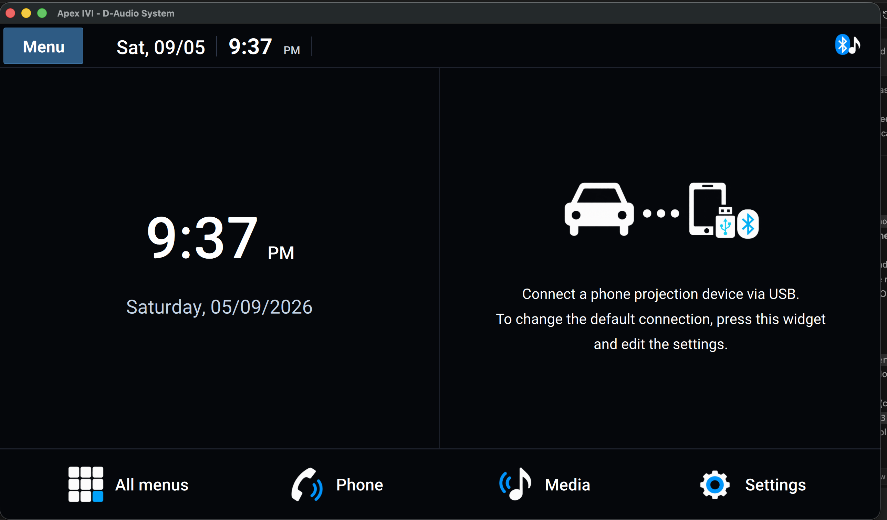
*Dual-card viewport displaying digital clock & date telemetry alongside the interactive phone projection widget and 4-button OEM bottom dock.*

<br/>

### 2. Live Broadcast Radio & Dynamic Two-Tone Tuner
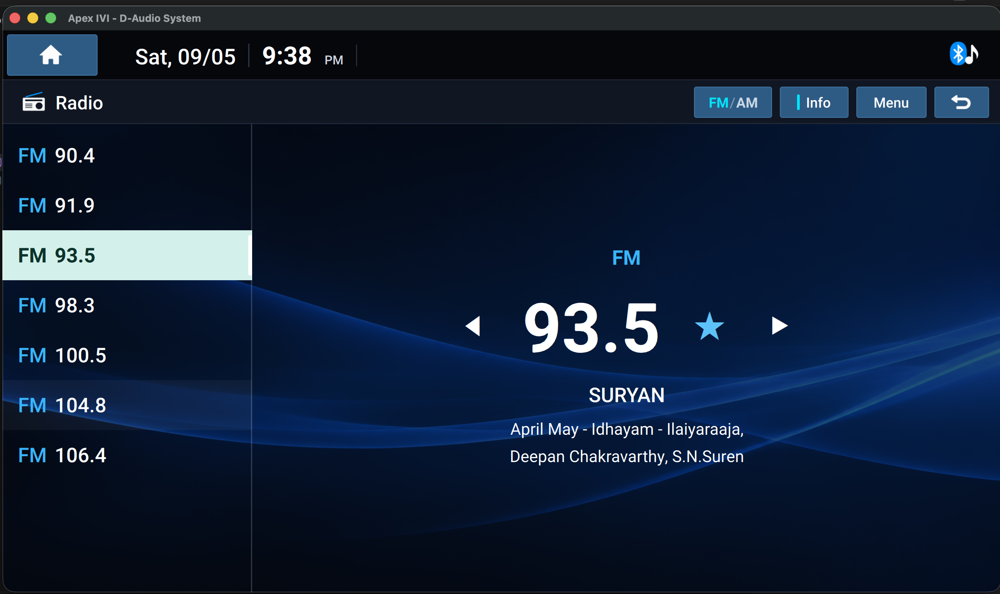
*Two-tone high-contrast radio tuner with cyan `FM`/`AM` indicator, white frequency typography (`93.5`), live Icecast audio stream metadata, and favorite preset management.*

<br/>

### 3. Floating OEM Volume HUD Overlay
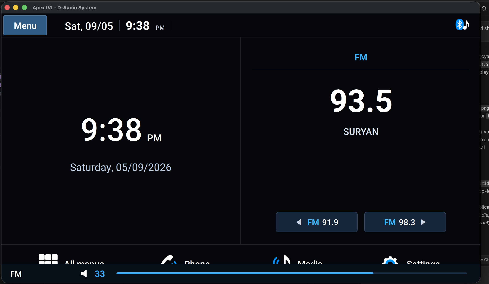
*Auto-dismissing floating volume bar with transparent speaker badge, active media source indicator, and numerical volume level readout (`FM 33`).*

<br/>

### 4. Automotive Application Launcher (All Menus)
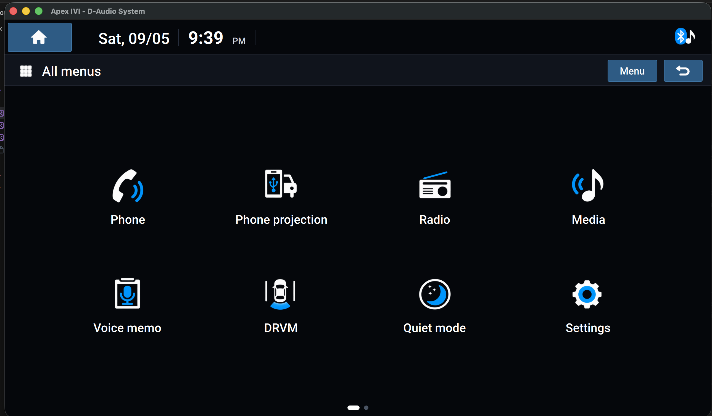
*High-contrast 3×4 automotive application grid providing quick navigation to all vehicle cockpit subsystems.*

<br/>

### 5. Driving Rear-View Monitor (DRVM) & Parking Assist
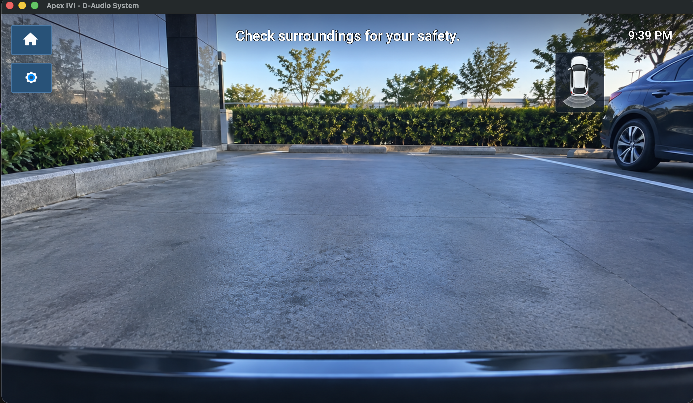
*Photorealistic 16:9 rear-view camera feed with multi-colored parking distance trajectories and ultrasonic obstacle radar sensor fusion.*

<br/>

### 6. Voice Memo Studio & Audio Visualizer
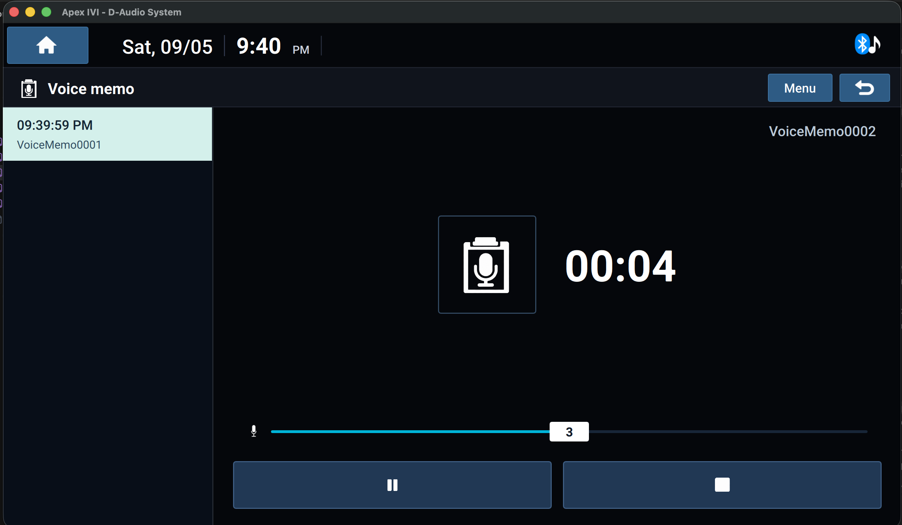
*Studio-grade voice recording interface with live waveform audio level meter, recording timer, transport controls, and local playlist.*

<br/>

### 7. Media Source Selection Hub
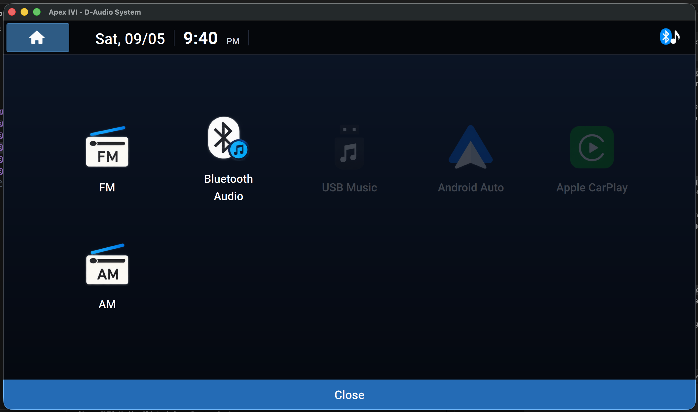
*Central media hub for switching between broadcast radio (FM/AM), Bluetooth Audio, USB storage, and mobile projections.*

<br/>

### 8. Bluetooth Device Manager & Priority Matrix
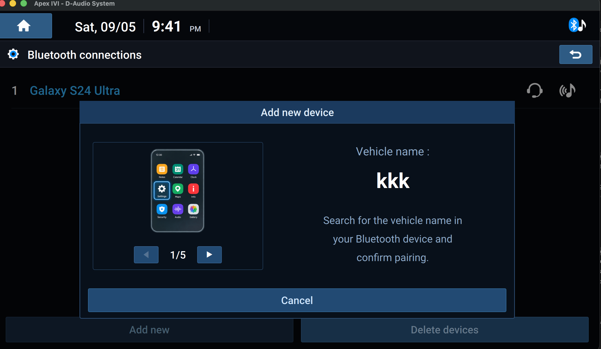
*5-device pairing matrix with interactive step-by-step visual pairing guide and independent Hands-Free Phone / Audio profile routing.*

<br/>

### 9. Acoustic Sound Staging & Spatial Position
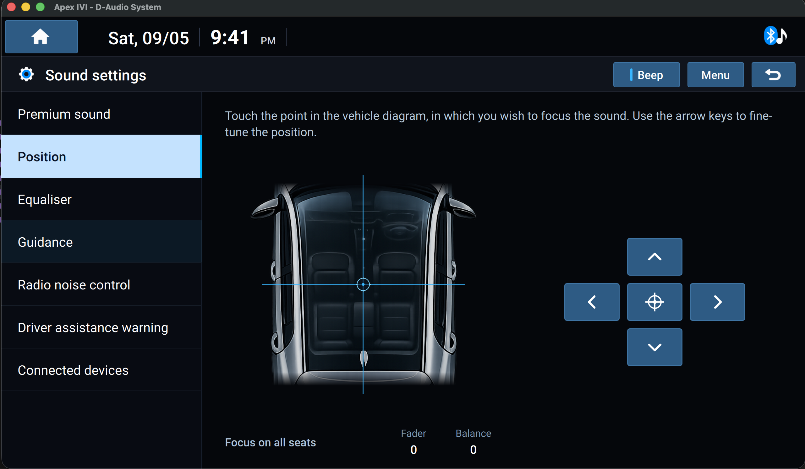
*Interactive 3D vehicle cabin sound staging with directional reticle for fader and balance acoustic alignment.*

<br/>

### 10. System Version & OTA Update Information
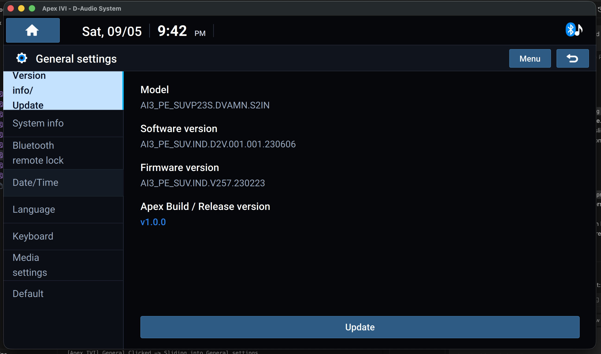
*Automotive specification dashboard showing Model code, Software version, Firmware version, and the active Apex Release Version (`v1.0.0`).*

</div>

---

## Developer & Attribution

- **Lead Developer**: **Sk Rehan Ahamed** ([@skrehanahamed](https://github.com/skrehanahamed))
- **Architecture**: Modern C++20, Qt 6.5+, QML, Native AVFoundation
- **Design Architecture**: Modern 8-inch Display Audio (D-Audio) Cockpit Infotainment System

---

## License

This project is licensed under the **MIT License** - see the [LICENSE](LICENSE) file for details.
